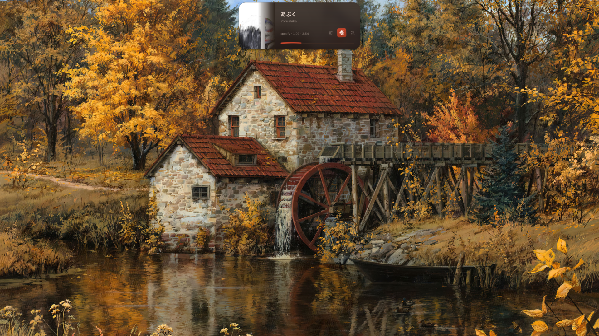
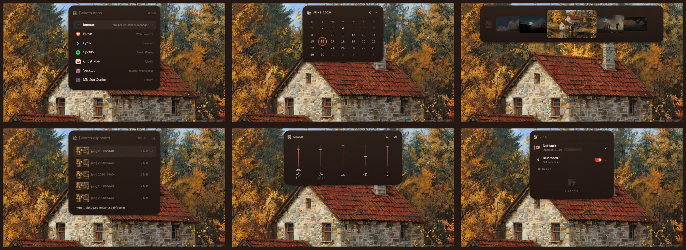
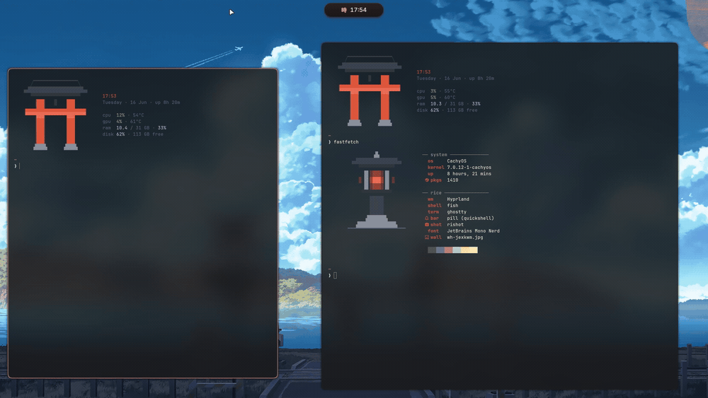
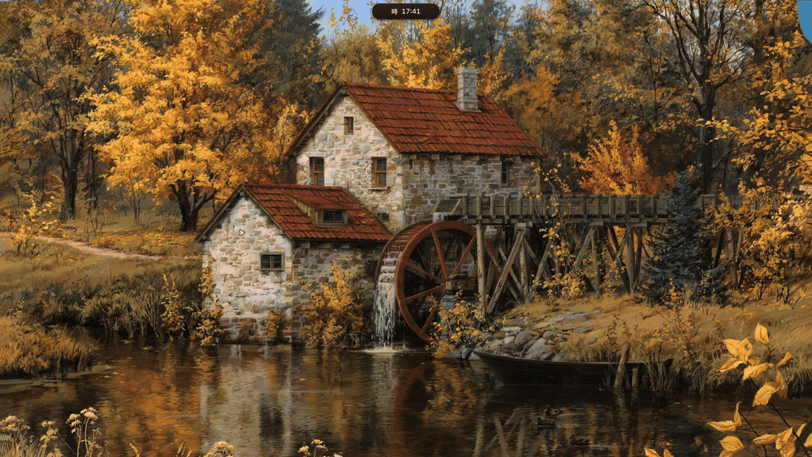

<div align="center">

# MasterR

**An aesthetic, highly integrated Arch Linux + Hyprland desktop ecosystem built on Quickshell with dynamic Material You theming.**

[](LICENSE)
&nbsp;
&nbsp;
&nbsp;

<br/>



</div>

---

## Overview

**MasterR** is a unified, fully customizable desktop environment for **Arch Linux** and **Hyprland**. Unlike traditional setups that cobble together disparate bars, notifications, and menus, the entire UI layer in MasterR is driven by a bespoke, high-performance **Quickshell (QtQuick/QML)** engine with live Material You wallpaper-driven color adaptation.

<div align="center">



</div>

---

## ✨ Features

### 🌟 Dynamic Quickshell Pill & Dock
- **Morphing Desktop Pill**: Seamlessly transforms into a media controller, calendar, audio mixer, brightness control, Bluetooth & Wi-Fi management, battery stats, system monitors, and toast notifications.
- **Floating Smart Dock**: Pinned application launcher, running application badges, and an interactive taskbar.
- **Workspace Overview**: Full-screen interactive overview (`SUPER + Tab`) rendering live workspace states and window thumbnails.
- **Super Finder**: Instant fuzzy file searching and opening (`SUPER + SHIFT + E` or `SUPER + SHIFT + F`).
- **Package Manager & Store**: Visual package browser and installer (`SUPER + SHIFT + Enter`) with intelligent error diagnosis and automatic dependency resolution.

### 🤖 AI Desktop Assistant
- **Universal Multi-Provider Chatbot**: Embedded directly in the Pill panel (`SUPER + ALT + Space`).
- Supports **OpenRouter**, **Gemini**, **Claude**, **Groq**, **DeepSeek**, **Mistral**, **OpenAI**, and local **Ollama** models.
- Real-time Server-Sent Events (SSE) token streaming for sub-second responses.
- Persistent session memory across system reboots.
- Safe system tool execution (file read/write, directory search, command staging) with user preview confirmation.

### 🎨 Material You Dynamic Theming
- Automatic color scheme extraction from any wallpaper using `matugen` and `wallcolors.py`.
- Synchronized live re-theming across:
  - Hyprland borders and glow accents
  - Quickshell Pill, Dock, Launcher, and Lockscreen surfaces
  - Ghostty terminal palette
  - Fastfetch ASCII Torii and hardware stats
  - Satty screenshot and annotation editor
  - GTK3, GTK4, Libadwaita, and KDE/Qt applications (Dolphin)

<div align="center">





</div>

### 🔒 Fullscreen Audio-Reactive Lockscreen
- Dynamic GLSL fragment shaders (`grade.frag`, `blur.frag`, `glow.frag`) with smooth unlock motion.
- Integrated audio spectrum visualizer powered by `cava`.
- PAM authentication with smooth shake animations on invalid password.

### 🪟 Liquid Glass Hyprland Layout
- **Spunky & Fluid Motion System**: Snappy spring curves with subtle overshoots (`spunky`, `fluidSpring`, `smoothFade`) for buttery window tiling and floating.
- **Sequential Workspace Scrolling**: Smooth step-through traversal when moving across distant workspaces.
- **Smart Window Tiling & Floating**:
  - `SUPER + T`: Toggle full-fill layout with 2px perimeter padding (keeps borders and bar visible).
  - `SUPER + SHIFT + T`: Toggle centered comfortable floating window (~78% screen geometry).
- **Special Workspaces**: Dedicated private, minimized, and stash scratchpads.

### 📸 Screenshot & Annotation Suite
- Integrated **Satty** annotation editor styled to match the active rice palette.
- **RiShot** Wayland region selector, window picker, and full-screen screenshot capture tool (`Print`, `SHIFT + Print`, `SUPER + Print`).
- Built-in screen recorder (`SUPER + D`) powered by `gpu-screen-recorder`.

---

## 🚀 Installation

### One-Line Bootstrap (Recommended)

Run the following command in your terminal on Arch Linux (or any supported derivative):

```sh
curl -fsSL https://raw.githubusercontent.com/Krish-Kamani/MasterR/main/install.sh | bash
```

### Manual Installation from Git

```sh
git clone https://github.com/Krish-Kamani/MasterR.git
cd MasterR
./install.sh
```

### Installer Options & Flags

```sh
# Quickstart (Default core profiles without prompt questions)
./install.sh --quickstart

# Full profile (Installs core + daily apps: dolphin, keepassxc, zathura, imv, rnote)
./install.sh --full

# Dry-run (Simulates all package and config steps without modifying the filesystem)
./install.sh --dry-run

# Reinstall or update existing deploy
./install.sh --reinstall

# Uninstall and restore pristine backups
./install.sh --uninstall
```

---

## ⌨️ Keybindings

| Keybinding | Action |
|---|---|
| `SUPER + Return` | Open Ghostty Terminal |
| `SUPER + Space` | Open Application Launcher |
| `SUPER + ALT + Space` | Toggle AI Desktop Chatbot |
| `SUPER + Tab` | Toggle Workspace Overview |
| `SUPER + SHIFT + E` / `SUPER + SHIFT + F` | Open Super Finder (File Search) |
| `SUPER + SHIFT + Return` | Open Package Manager |
| `SUPER + V` | Open Clipboard History |
| `SUPER + C` | Open Wallpaper Selector |
| `SUPER + B` | Shuffle Random Wallpaper & Retheme |
| `SUPER + T` | Toggle Full-Fill Floating Window |
| `SUPER + SHIFT + T` | Toggle Centered Floating Window |
| `SUPER + Q` | Close Active Window |
| `SUPER + L` | Lock Screen |
| `SUPER + D` | Toggle Screen Recorder |
| `SUPER + G` | Toggle Game Mode (Disable animations/blur) |
| `SUPER + /` | Open Keybindings Cheat Sheet |
| `Print` | Capture Fullscreen Screenshot |
| `SHIFT + Print` / `SUPER + SHIFT + S` | Capture Region Screenshot to Satty |
| `SUPER + Print` | Capture Active Window Screenshot |
| `SUPER + 1` .. `9`, `0` | Switch to Workspace 1–10 (Sequential Smooth Scroll) |
| `SUPER + ALT + 1` .. `9`, `0` | Move Active Window to Workspace 1–10 |
| `SUPER + S` | Toggle Stash Workspace |
| `SUPER + P` | Toggle Private Workspace |
| `SUPER + SHIFT + M` | Toggle Minimized Windows Workspace |

---

## 🛠️ CLI Management (`masterr`)

MasterR includes a control utility linked to your `$PATH`:

```sh
# Check running surfaces and installed version
masterr status

# Restart the Pill bar or Lock surface
masterr restart pill
masterr restart lock
masterr restart all

# View live quickshell logs
masterr log pill

# Check and apply updates cleanly while preserving your custom settings
masterr update

# Cleanly uninstall and restore your original configurations
masterr uninstall
```

---

## ⚙️ Customization & Structure

```
~/.config/
├── hypr/
│   ├── hyprland.lua       # Main compositor configuration
│   ├── modules/           # Modular Lua settings (binds, animations, decoration, rules)
│   └── scripts/           # Automation & helper scripts
├── quickshell/
│   ├── pill/              # Pill bar & widgets (Chatbot, Finder, Dock, Media, etc.)
│   ├── lock/              # Fullscreen lockscreen & Cava visualizer
│   ├── overview/          # Workspace overview
│   └── launcher/          # App launcher
├── ghostty/config         # Terminal styling
├── fish/config.fish       # Shell configuration & Torii banner
├── satty/config.toml      # Screenshot editor theme & settings
└── fastfetch/             # System information splash
```

---

## 🔒 Privacy Guarantee

- **Zero Personal Data**: The repository contains no hardcoded user paths, personal SSH keys, browser sessions, or tokens.
- **Configurable AI Keys**: Store your API keys safely through the Chatbot settings UI or by exporting standard environment variables (`OPENROUTER_API_KEY`, `GEMINI_API_KEY`, `ANTHROPIC_API_KEY`, `GROQ_API_KEY`, `DEEPSEEK_API_KEY`, `OPENAI_API_KEY`, etc.).

---

## 💖 Credits & Acknowledgements

Special thanks and huge credit to:
- **[Gakuseei](https://github.com/Gakuseei)** — Original author and creator of the foundational Quickshell architecture, Torii aesthetic theme, lockscreen shaders, and [rishot](https://github.com/Gakuseei/rishot). If you love this setup, consider supporting [Gakuseei on Ko-fi](https://ko-fi.com/gakuseei).
- **[Quickshell](https://github.com/quickshell-mirror/quickshell)** — The next-generation QtQuick/QML desktop shell framework for Wayland.
- **[Hyprland](https://github.com/hyprwm/Hyprland)** — Dynamic tiling Wayland compositor.
- **[Matugen](https://github.com/InioX/matugen)** — Material You color palette generator.
- All wallpaper and asset artists credited in [CREDITS.md](configs/sddm/themes/torii/CREDITS.md) and [WALLPAPERS.md](WALLPAPERS.md).

---

## 📜 License

This project is licensed under the [MIT License](LICENSE).
Copyright (c) 2026 Gakuseei, Krish Kamani.
See [CREDITS](configs/sddm/themes/torii/CREDITS.md) for third-party asset credits.
