<div align="center">

# MasterR

**An aesthetic, highly integrated Arch Linux + Hyprland desktop ecosystem built on Quickshell with dynamic Material You theming, Liquid Glass switcher, Zen Browser integration, and Live Video Wallpapers.**

[](LICENSE)
&nbsp;
&nbsp;
&nbsp;
&nbsp;
&nbsp;
&nbsp;

<br/>


</div>

---

## 🌟 Overview

**MasterR** is a unified, fully customizable desktop environment for **Arch Linux** and **Hyprland** (with multi-distro installer support for Debian/Ubuntu, Fedora, and openSUSE). Unlike traditional setups that cobble together disparate bars, notifications, applets, and menus, the entire UI layer in MasterR is driven by a bespoke, high-performance **Quickshell (QtQuick/QML)** engine.

---

## ⚡ Quick Installation

### 🚀 Automatic Install (Recommended)
Paste and run this single command on **Arch Linux** (or supported derivatives):
```bash
curl -fsSL https://raw.githubusercontent.com/Krish-Kamani/MasterR/main/install.sh | bash
```

### 🛠️ Manual Installation (Git Clone)
If you prefer cloning the repository manually:
```bash
git clone https://github.com/Krish-Kamani/MasterR.git
cd MasterR
./install.sh
```

> [!TIP]
> **Advanced Flags & Theme Setup**:  
> For headless runs (`--quickstart`), dry-run simulation (`--dry-run`), full suite apps (`--full`), or SDDM & GRUB theme setup, jump to the [Detailed Installation & Setup](#-installation--setup) guide below.

---

MasterR pairs bleeding-edge Wayland desktop aesthetics with deep hardware integration:
* **Zen Browser as Flagship**: First-class privacy and vertical tabs browsing experience with hybrid GPU acceleration (`prime-run zen-browser`).
* **Instant Liquid Glass Switcher**: On-the-fly switching between specular bevel glass translucency and high-contrast solid mode.
* **Autonomous AI Desktop Assistant**: Embedded multi-provider streaming assistant supporting 11+ AI platforms with system tool calling.
* **Dynamic Material You Synchronization**: Automatic palette extraction from live video wallpapers or 4K stills, dynamically synchronized across the desktop, terminals, GTK/Qt apps, **SDDM login screen**, and **GRUB bootloader**.
* **Zero-Flicker Game Mode**: Instant visual stripping to maximize frame rates and eliminate input latency for competitive gaming.
* **Universal Depot Drop-Installer**: Drag-and-drop AppImages, packages, archives, fonts, and wallpapers directly into the shell.

<div align="center">


</div>

---

## 🚀 Curated Core Application Stack

MasterR comes pre-configured with a carefully selected suite of modern, high-performance tools:

| Category | Application | Command / Keybinding | Highlights |
|---|---|---|---|
| **Web Browser** | **Zen Browser** | `SUPER + B` (`prime-run zen-browser`) | Open-source Firefox fork, native vertical tabs, tab workspaces, split views, privacy-first (no Google tracking/telemetry), discrete GPU offloading, and seamless glass styling. |
| **Terminal** | **Ghostty** | `SUPER + Return` (`ghostty`) | Blazing-fast GPU-accelerated Wayland terminal with live DBus color palette re-theming and dynamic glass opacity. |
| **File Manager** | **Dolphin** | `SUPER + E` (`dolphin`) | Powerful KDE file manager fully styled with MasterR dark Material You color schemes. |
| **Code Editor** | **VSCodium** / **VS Code** | `SUPER + C` (`prime-run vscodium`) | Clean, telemetry-free open-source code editor launched with dedicated GPU graphics acceleration. |
| **Gaming** | **PrismLauncher** | `SUPER + X` (`prime-run prismlauncher`) | Open-source, modpack-ready Minecraft launcher with automatic Java management and GPU offload. |
| **Shell & Info** | **Fish + Fastfetch** | Terminal Startup | Interactive shell with syntax highlighting, custom Torii/MasterR greeting banner, and ASCII lantern hardware splash. |

> [!TIP]
> **Why Zen Browser instead of Google Chrome?**  
> MasterR chooses **Zen Browser** as its flagship browser because it provides an uncompromising blend of privacy, speed, and modern interface design. Built on Gecko/Firefox, Zen rejects invasive tracking, eliminates Chromium-based ad-blocker restrictions (Manifest V3), and natively features vertical tabs, customizable workspaces, and split-page views that perfectly complement Hyprland's tiling workflow.

---

## ✨ Features & Architecture

### 🪟 Liquid Glass & Solid Mode Switcher

MasterR features an instant dual-profile rendering engine switchable on the fly:
* **Liquid Glass Mode (`SUPER + =` or `SUPER + +`)**:
  * Activates `decoration.lua.glass` and `window_rules.lua.glass` with specular bevel borders (`rgba(ffffff66)`), 20px curvature, active window opacity (`0.88`), inactive opacity (`0.48`), and dual-pass blur.
  * Adjusts Ghostty terminal background opacity to `0.70` and Quickshell Pill opacity to `0.25`.
* **Solid Mode (`SUPER + -`)**:
  * Activates `decoration.lua.solid` and `window_rules.lua.solid` for opaque, high-contrast window rendering.
  * Restores Ghostty background opacity to `1.00` and Quickshell Pill opacity to `1.0`.
* **Fluid Motion Physics**: Butter-smooth window tiling, floating, and workspace transitions powered by spring curves (`spunky`, `fluidSpring`, `smoothFade`).
* **Smart Window Tiling & Floating**:
  * `SUPER + T`: Toggle comfortable full-fill floating window layout.
  * `SUPER + SHIFT + T`: Toggle centered floating window (~78% screen geometry).
  * `SUPER + M`: Toggle minimize active window into the Quickshell dock tray.
  * `SUPER + F`: Toggle true fullscreen.
  * `SUPER + LMB` / `RMB`: Interactive window drag and resize.
  * Multi-touch gestures: 3-finger swipe window drag and 4-finger workspace swipe.

<div align="center">

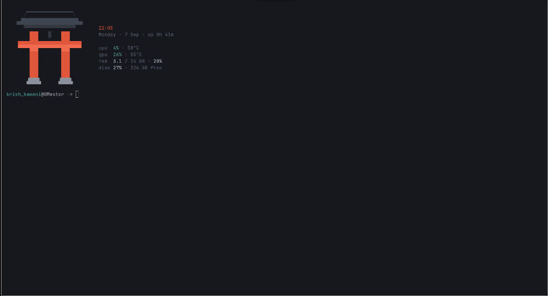

</div>

---

### ⚡ Zero-Flicker Game Mode (`SUPER + G`)

MasterR includes a dedicated competitive gaming mode (`configs/hypr/scripts/gamemode.sh`):
* **Instant Visual Stripping**: Executed via `hyprctl eval` for zero screen flicker and no compositor restart.
* **Performance Maxima**: Strips all window gaps, borders, rounded corners, dual-pass blur, shadows, and animations to yield maximum GPU frame rates and minimum input latency.
* **Safe State Restoration**: Automatically captures a snapshot of your exact pre-game aesthetic parameters in `$XDG_STATE_HOME/masterr/gamemode-snapshot.json`. Toggling Game Mode off cleanly restores your exact previous decoration profile.

---

### 🤖 Universal AI Desktop Assistant (`SUPER + ALT + Space`)

Embedded directly into the Quickshell Pill overlay with real-time Server-Sent Events (SSE) token streaming:
* **Supported AI Providers**:
  * **OpenRouter** (Unified access to free & premium LLMs)
  * **Google Gemini** (Gemini 2.5 Pro, Flash, Flash Thinking, Gemma 2)
  * **Anthropic Claude** (Claude 3.5 Sonnet, Haiku, Opus)
  * **Groq** (Ultra-fast Llama 3.3 70B, DeepSeek R1 Distill, Mixtral)
  * **DeepSeek** (DeepSeek-V3, DeepSeek-R1 Reasoner)
  * **Mistral AI** (Mistral Large, Codestral, Mixtral)
  * **OpenAI** (GPT-4o, GPT-4o-mini, o1, o3-mini)
  * **NVIDIA NIM** (Llama 3.3 70B Instruct, Nemotron)
  * **Sarvam AI**
  * **Local Ollama** (Llama 3.2, DeepSeek-R1 8B, Qwen 2.5 Coder)
  * **Self-Hosted Local Endpoints** (vLLM, LM Studio, LocalAI)
* **Safe System Tool Execution**: Autonomous filesystem inspection and command execution (`read_file`, `list_directory`, `write_file`, `delete_file`, `execute_command`) with visual UI confirmation dialogues before running.
* **Persistent Session Management**: Multi-session conversation history preserved across reboots with auto-titling and slash commands (`/new`, `/clear`, `/sessions`, `/connect`, `/models`, `/help`).
* **Automatic Key Discovery**: Automatically discovers and imports API keys from `~/API-KEYs.md` or standard environment variables (`OPENROUTER_API_KEY`, `GEMINI_API_KEY`, `ANTHROPIC_API_KEY`, `GROQ_API_KEY`, etc.).
* **Panel Resizing**: Adjust panel width (`Ctrl + +` / `Ctrl + -`) and height (`Ctrl + Shift + +` / `Ctrl + Shift + -`).

<div align="center">

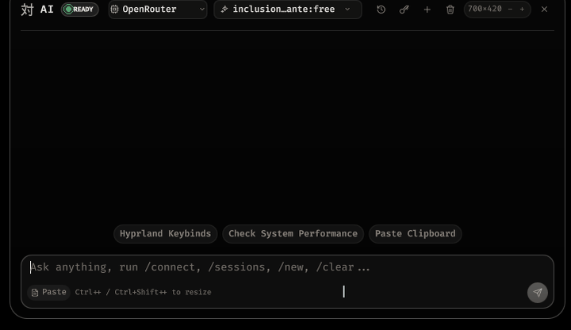

</div>

---

### 🌟 Dynamic Quickshell Pill & Smart Dock Ecosystem

* **Morphing Desktop Pill**: The central desktop status pill morphs seamlessly on click into specialized sub-surfaces for media, calendar, volume, display, network, bluetooth, power, hardware monitors, and updates.
* **Floating Smart Dock**:
  * **3 Pin Modes**: Always Pinned, Smart Pin (only visible on empty desktop), or Auto-Hide (reveals on bottom edge hover).
  * **Monochrome Icons Mode**: Toggles Material You unified monochrome icons across all pinned and running apps.
  * **Interactive App Manager**: Search, pin, unpin, and re-order dock applications with instant persistence.
  * **Active Taskbar & Minimized Tray**: Real-time running indicators, app title tooltips, and a dedicated minimized window tray.

<div align="center">

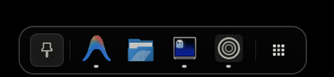

</div>

* **Workspace Overview (`SUPER + Tab`)**: Interactive full-screen view rendering live workspace states, window thumbnails, and intuitive workspace navigation.

<div align="center">

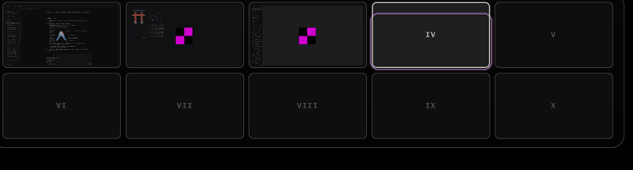

</div>

* **Super Finder & File Search (`SUPER + SHIFT + E` or `SUPER + SHIFT + F`)**: Instant fuzzy file and folder search powered by `find-files.py` with multi-tier relevance ranking and smart application resolution.

<div align="center">

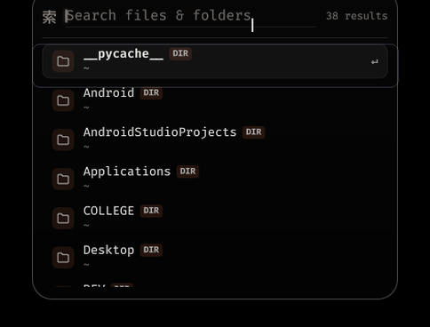

</div>

---

### 🗂️ Advanced Workspace Navigation & Scratchpads

* **Sequential Smooth Workspace Scrolling (`configs/hypr/scripts/scroll-workspace.sh`)**:
  * When jumping between non-adjacent workspaces (e.g., `SUPER + 1` to `SUPER + 5`), MasterR rapidly traverses intermediate workspaces (`2 -> 3 -> 4 -> 5`) with dynamic delays tuned to Hyprland's slide curves, providing a cinematic horizontal panorama.
* **Special Workspaces**:
  * **Private Workspace (`SUPER + P`, `SUPER + SHIFT + P`)**: An isolated scratchpad workspace designed for sensitive browsing and confidential tasks.
  * **Stash Workspace (`SUPER + S`, `SUPER + CTRL + ALT + S`)**: Quick scratchpad to tuck away temporary utility windows, terminal scratchpads, or notes.
  * **Minimized Window Tray (`SUPER + M`, `SUPER + SHIFT + M`)**: Minimize background windows to the dock tray and restore them in 1-click.

---

### 📦 Universal Drag-and-Drop Depot Installer (`app-install.sh`)

Drag and drop files directly onto the launcher surface to install or import them automatically:
* **AppImages (`.AppImage`)**: Automatically moves binaries to `~/Applications`, extracts squashfs application icons, writes desktop entries, registers them in `appimages.json`, and enables 1-click updates and uninstallation.
* **Native Packages (`.pkg.tar.zst`, `.deb`, `.rpm`)**: Unpacks and installs binaries into userland without requiring root privileges.
* **Flatpak References (`.flatpakref`)**: One-drop Flatpak application installation.
* **Userland Archives (`.tar.gz`, `.tar.xz`, `.zip`)**: Depot unpacking with automatic ELF binary discovery and launcher integration.
* **Fonts (`.ttf`, `.otf`)**: Automatically installs to `~/.local/share/fonts/` and reloads fontconfig cache (`fc-cache -f`).
* **Wallpapers (`.mp4`, `.jpg`, `.png`)**: Automatically imports to `~/Pictures/Wallpapers/` with live preview and instant palette regeneration.

---

### 🛍️ Visual Package Store & Auto-Repair Engine (`SUPER + SHIFT + Return`)

* **Visual Package Browser**: Fast, asynchronous search across Official Arch Repositories (OAR) and Arch User Repositories (AUR) with popularity rankings.
* **Curated App Catalog**: Browse popular tools across Web Browsers (**Zen Browser**, Brave, Thorium, Librewolf, Floorp, Firefox), Development (VS Code, VSCodium, Cursor, Zed, Neovim, JetBrains Toolbox, Docker), Communication (Discord, Vesktop, Telegram, Signal), Media, and Gaming.

<div align="center">

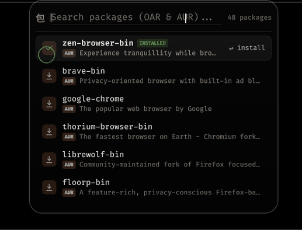

</div>

* **Interactive Installer with Automated Root Cause Diagnosis (`package-install.py`)**:
  * Runs in a floating Ghostty window with custom MasterR styling.
  * **Pacman Database Lock**: Detects stale `/var/lib/pacman/db.lck` and unlocks with 1-click.
  * **PGP Keyring Corruption**: Automatically refreshes `archlinux-keyring` and syncs keys.
  * **File Collisions**: Auto-applies `--overwrite "*"` retry.
  * **Missing `base-devel`**: Auto-installs build tools for AUR compilation.
  * **Mirror Out of Sync (404s)**: Auto-synchronizes package databases (`pacman -Syy`).
  * **Disk Full**: Cleans cached packages (`pacman -Sc`).

---

### 🖥️ Multi-Monitor Display Control Sub-Surface (`Display.qml`)

* In-Pill GUI for managing single and multi-monitor setups without manually editing configuration files.
* **Live Display Settings**:
  * Resolution switching (e.g., 1080p, 1440p, 4K UHD).
  * Refresh rate selection (60Hz, 120Hz, 144Hz, 165Hz, 240Hz).
  * Fractional display scaling (100%, 125%, 150%, 175%, 200%).
  * Display orientation, rotation, mirroring, and layout arrangement.
  * Automatically writes settings to `monitors.lua` and applies via `display-apply.sh`.

---

### 📊 Filament Telemetry & Real-Time System Monitor (`SysmonSurface.qml`, `Filament.qml`)

* **Analog Filament Gauges**: High-aesthetic ring telemetry for system resources.
* **CPU Monitoring**: Overall CPU utilization, per-core workload breakdown, and core thermals.
* **GPU Monitoring**: Real-time GPU load, VRAM utilization, GPU core clocks, and temperature (supports both NVIDIA and AMD GPUs).
* **Memory & Storage**: RAM consumption, Swap memory usage, and disk read/write throughput.
* **Network Speeds**: Live upload and download bandwidth meters.

---

### ⚙️ Connectivity, Audio & Hardware Sub-Surfaces

* **Live Wi-Fi Manager (`WifiSurface.qml`)**: Real-time network scanning, signal strength bars, connect/disconnect, and password prompts inside the Pill.
* **Bluetooth Device Manager (`BtSurface.qml`)**: Scan, pair, and connect Bluetooth peripherals (mice, keyboards, controllers, headphones) with live battery telemetry.
* **Battery & Power Profiles (`BatterySurface.qml`)**: Charge rate in watts, runtime estimation, and ACPI power profile switcher (Power-Saver, Balanced, Performance).
* **Audio Mixer & Caffeine Mode (`Mixer.qml`)**:
  * Per-application volume faders powered by PipeWire / WirePlumber.
  * Audio input/output device switching.
  * **Keep-Awake / Caffeine Inhibitor**: 1-click toggle to suppress Wayland idle lock and DPMS sleep during video playback, gaming, or presentations.
* **Idle & Sleep Timeout Manager (`IdleLock.qml`)**:
  * Interactive GUI sliders for Auto-lock, Screen Off (DPMS), and System Suspend timeouts.
  * Automatically recompiles `hypridle.conf` and reloads the daemon live.
* **Laptop Fan Speed Controller (`fan-speed.sh`)**:
  * ACPI fan mode switcher (`quiet`, `balanced`, `performance`, `auto`) for Lenovo IdeaPad, Legion, and LOQ laptops via sysfs, `legion-cli`, and `isw`.
* **Live Weather Glance (`Weather.qml`)**:
  * Keyless weather integration via Open-Meteo with automatic IP geocoding (or custom city override), 24h hourly forecast, 5-day daily forecast, and Japanese kanji weather glyphs (晴, 曇, 雨, 雪, 霧, 雷, 月).
* **Live System Font Picker (`FontPicker.qml`)**:
  * Dynamically scans installed system fonts with live typography previews, changing desktop shell fonts across all Quickshell components in real time (`Flags.uiFont`).
* **Heat-Hold Destructive Safety Ring (`HeatHold.qml`)**:
  * Animated hold-to-confirm ring for critical actions (power-off, reboot, clipboard wipe, wallpaper deletion) to prevent accidental clicks.
* **Clipboard History with Thumbnails (`cliphist-thumbs.sh`, `SUPER + V`)**:
  * High-speed clipboard history manager with image thumbnails, instant search, item deletion, and hold-to-wipe protection.

---

### 🎨 Material You Dynamic Theming & SDDM/GRUB Sync

* Automatic color palette extraction from any static wallpaper or live video frame using `matugen` and `wallcolors.py`.
* Synchronized live re-theming across:
  * Hyprland borders, window shadows, and glow accents
  * Quickshell Pill, Dock, Launcher, and Lockscreen surfaces
  * Ghostty terminal palette (hot-reloaded via DBus)
  * Fastfetch ASCII Lantern/Torii art and hardware telemetry
  * Satty screenshot annotation editor
  * GTK3, GTK4, Libadwaita, and KDE/Qt applications (Dolphin)
* **Dynamic Boot & Login Screen Sync (`sync-theme-wallpaper.sh`)**:
  * Whenever you change your wallpaper (video or still), MasterR extracts a crisp 1080p frame and dynamically syncs both the **SDDM login screen** and the **GRUB bootloader theme** backgrounds in real-time.
* **Manual Hue Override & Palette Styles**: Choose between wallpaper-driven color generation or custom manual hue angles (`--hue <deg>`) with tone styles (Vibrant, Expressive, TonalSpot, FruitSalad, Rainbow, Neutral).

<div align="center">


</div>

---

### 🌊 Fluid Physics & Motion Curve Customizer (`AnimationSurface.qml`, `Motion.qml`)

* Live slider adjustments for spring physics: stiffness, damping, mass, and transition durations.
* 5 bespoke animation curve presets:
  * `spunky`: Energetic and tactile with slight rebound.
  * `fluidSpring`: Ultra-smooth organic motion.
  * `smoothFade`: Minimalist and cinematic.
  * `bouncy`: Playful spring physics.
  * `snappy`: Instantaneous response for competitive workflows.

---

### 🔄 In-Pill Interactive GUI Update Manager (`Updates.qml`)

* Complete terminal-free update manager inside the Pill settings.
* **Live Changelog & Commit Diffing**: Displays exact commit count behind, date ranges, and interactive "WHAT'S NEW" highlights.
* **Interactive 3-Way Conflict Resolver**: Offers "Keep mine" vs "Take new" toggles for protected user configuration files (`binds.lua`, `decoration.lua`, `monitors.lua`, `input.lua`, `env.lua`, `autostart.lua`, `animations.lua`, `hypridle.conf`).
* **Automatic Core Package Provisioning**: Automatically detects and installs new system dependencies required by updates.

---

### 📸 Screenshot, Annotation & Screen Recording Suite

* **Satty Annotation Editor**: Seamlessly styled screenshot editor matching the active rice palette.
* **RiShot Wayland Tooling**: Fullscreen, region, and active window screenshot modes (`Print`, `SHIFT + Print`, `SUPER + Print`, `SUPER + ALT + S`).
* **GPU Screen Recorder (`SUPER + D` / `record.sh`)**: Hardware-accelerated screen recording powered by `gpu-screen-recorder` with audio source selection, active recording indicators, and automatic thumbnail generation in `~/.cache/masterr/rec-thumbs/`.
* **Clipboard History (`SUPER + V`)**: Rich clipboard history manager with image thumbnails (`cliphist-thumbs.sh`), search, and hold-to-wipe protection.

---

### 🧩 Automatic Desktop App Icon Fixer (`auto-app-icon-fixer`)

* **Automatic Icon Diagnosis**: Scans all XDG `.desktop` files across user, system, Flatpak, and Snap directories for missing, broken, or generic icons.
* **Multi-Tier Search Engine**: Searches other theme categories (e.g., `devices/`, `panel/`), SimpleIcons vector CDN, Wikimedia Commons, and DuckDuckGo for official vector/raster logos.
* **Automatic Desktop Database Refresh**: Downloads high-resolution icons to `~/.local/share/icons/`, patches `~/.local/share/applications/*.desktop`, and triggers `update-desktop-database`.
* **Systemd On-Boot Service**: Includes `auto-app-icon-fixer.service` to automatically heal newly installed application icons on login.

---

### 🌙 Night Light / Blue-Light Filter (`hyprsunset`)

* **Integrated Display Warmth**: Hyprland `hyprsunset` daemon integration for blue-light filtering.
* **Flexible Modes**: `on`, `off`, and `scheduled` with configurable color temperature (2200K to 6000K), sunrise/sunset timing, and dynamic generation of `~/.config/hypr/hyprsunset.conf`.
* **Instant IPC**: Pushes changes directly to the running daemon without screen flickering.

---

### 🔒 Fullscreen Audio-Reactive Lockscreen

* **GLSL Fragment Shaders**: Custom `grade.frag`, `blur.frag`, and `glow.frag` shaders with smooth unlock transitions.
* **Cava Audio Visualizer**: Integrated real-time audio spectrum visualizer that dances to your music while locked.
* **PAM Authentication**: Secure PAM login with shake animations on invalid password.

---

## 🖼️ Wallpaper Collection Showcase

MasterR comes pre-loaded with an extensive library of **Live Video Wallpapers** and **Ultra-HD 4K Stills** located in `wallpapers/`:

### 🎬 Live Video Wallpapers (`.mp4`)

| Animated Preview | Wallpaper Filename | Resolution | Theme / Description |
|:---:|---|:---:|---|
| 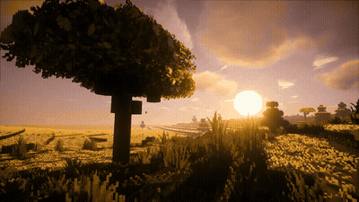 | `48efa30b1f_minecraft-sunset-live-wallpaper.mp4` | 1080p | Minecraft Sunset horizon with dynamic clouds |
| 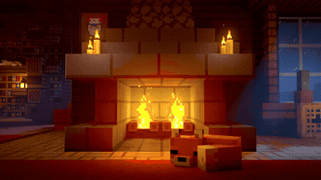 | `9001cbba8b_minecraft-cozy-fireplace.mp4` | 1080p | Cozy Minecraft fireplace with glowing ember particles |
| 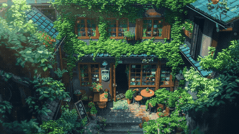 | `fea2357f62_ghibli-coffee-shop-1920x1080.mp4` | 1080p | Studio Ghibli aesthetic warm coffee shop |
| 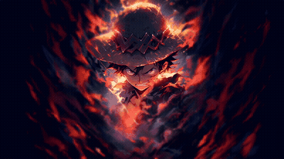 | `14a5e8631f_luffy-smoke-one-piece.mp4` | 1080p | One Piece Monkey D. Luffy Gear 5 smoke particles |
| 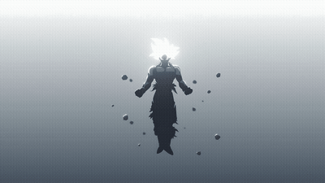 | `goku-ultra-instinct_2.1920x1080.mp4` | 1080p | Dragon Ball Son Goku Ultra Instinct aura |
| 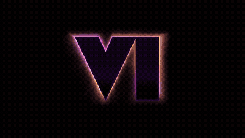 | `ce9de7743b_grand-theft-auto-6-live-wallpaper.mp4` | 1080p | GTA VI Vice City sunset neon aesthetics |
| 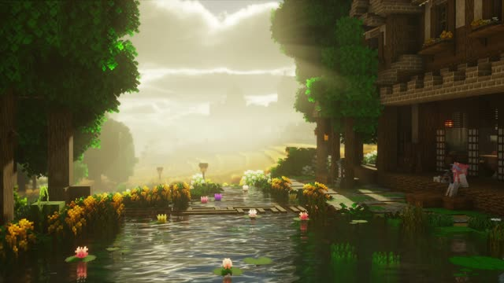 | `c8f816f17c_minecraft-tranquil-morning-pond.mp4` | 1080p | Tranquil Minecraft morning pond reflections |
|  | `ayanami-rei-beneath-blue-light.1920x1080.mp4` | 1080p | Evangelion Rei Ayanami blue ambience |
| 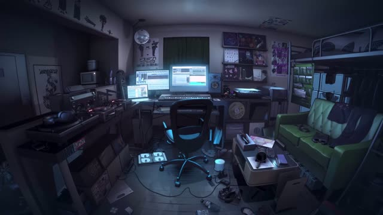 | `hatsune-miku.1920x1080.mp4` | 1080p | Hatsune Miku concert stage neon lights |
| 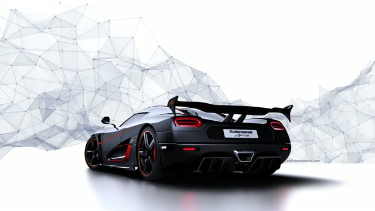 | `aea7591f05_ferrari-koenigsegg.mp4` | 1080p | Hypercars Ferrari & Koenigsegg highway drift |
| 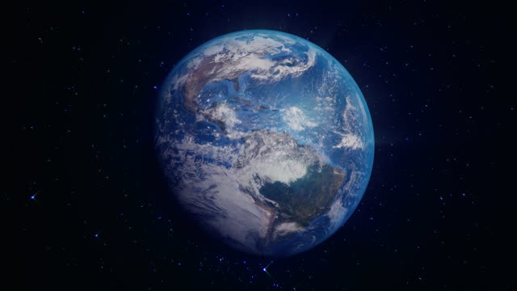 | `74a66690c6_blue-earth-1920x1080.mp4` | 1080p | Orbital view of Planet Earth in space |
| 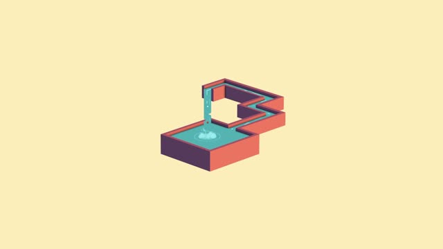 | `a46163fcfd_impossible-waterfall-1920x1080.mp4` | 1080p | Fantasy impossible floating waterfall |
| 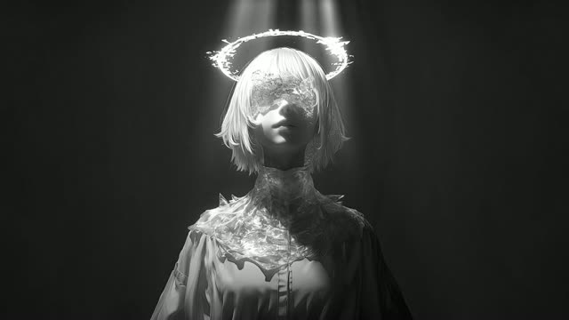 | `celestial-veil.1920x1080.mp4` | 1080p | Cosmic nebula celestial veil |
| 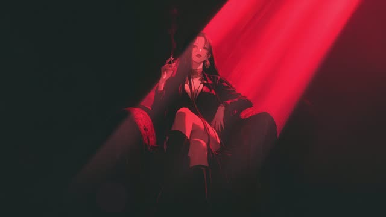 | `crimson-silence.1920x1080.mp4` | 1080p | Minimalist red and dark silhouette animation |
| 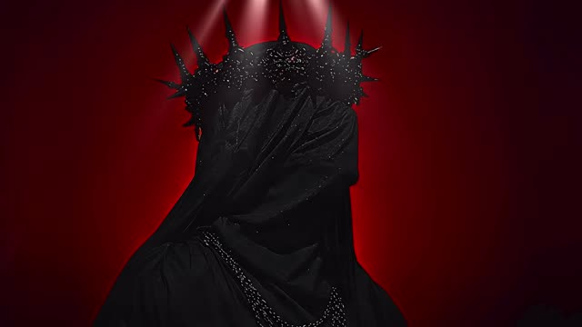 | `dark-king-abyss.1920x1080.mp4` | 1080p | Dark fantasy abyss knight with burning red eyes |
| 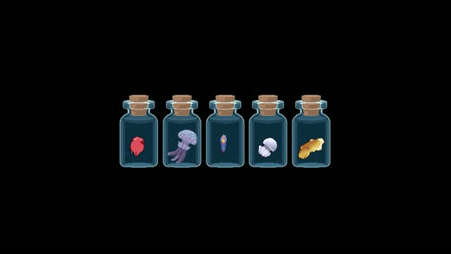 | `dbec3b0031_ocean-creatures-in-jar.mp4` | 1080p | Bioluminescent deep sea creatures |
| 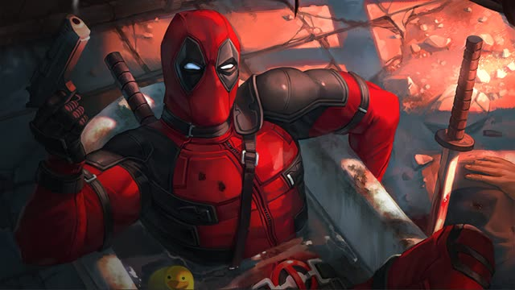 | `ed45a37832_deadpool-bathing-marvel.mp4` | 1080p | Deadpool comedic bath with rubber duckies |
| 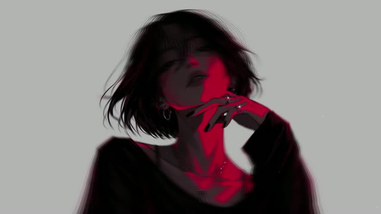 | `evelyn.1920x1080.mp4` | 1080p | Cyberpunk 2077 Judy & Evelyn neon aesthetic |
| 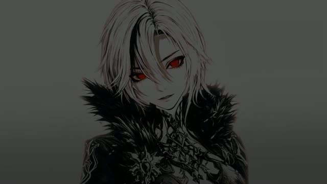 | `genshin-csm-trend-live-wallpaper.mp4` | 1080p | Genshin Impact stylish anime animation |
|  | `rgb-crown-king-live-wallpaper.mp4` | 1080p | Cybernetic RGB glowing crown |
| 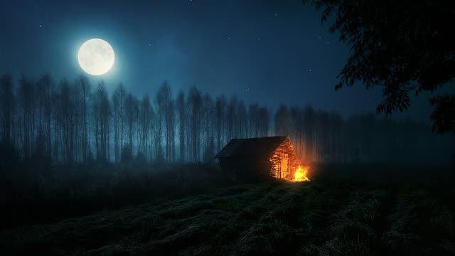 | `0807091879_woodshed-at-night-1920x1080.mp4` | 1080p | Wood cabin shed under starry night sky |
| 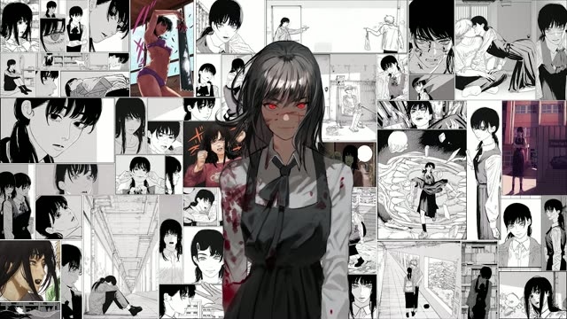 | `803fd223df_enigmatic-manga-montage.mp4` | 1080p | Fast-paced monochrome manga panel montage |

---

### 🖼️ 4K Ultra-HD Static Wallpapers

| Preview | Wallpapers | Resolution | Theme Style |
|:---:|---|:---:|---|
| 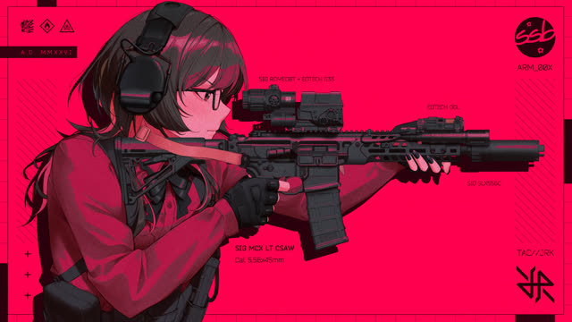 | `wallhaven-3q6m6y` | 4K UHD | Atmospheric Japanese shrine landscape |
| 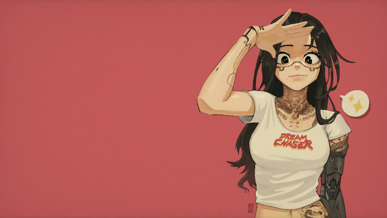 | `wallhaven-6lyo7x` | 4K UHD | High-tech cyberpunk cityscape |
| 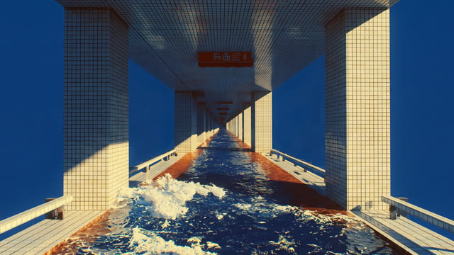 | `wallhaven-8gjxoy` | 4K UHD | Deep space nebula & celestial glow |
| 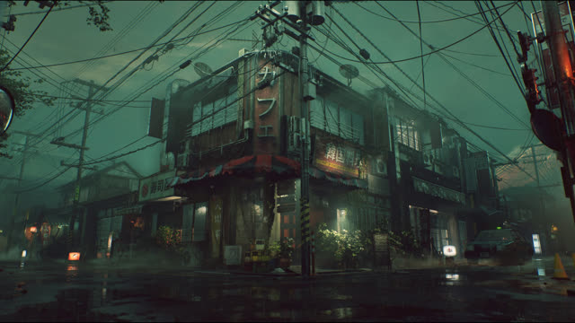 | `wallhaven-lyj56q` | 4K UHD | Anime scenery with vibrant sunset sky |
|  | `wallhaven-mlg59k` | 4K UHD | Futuristic neon metropolis highway |
| 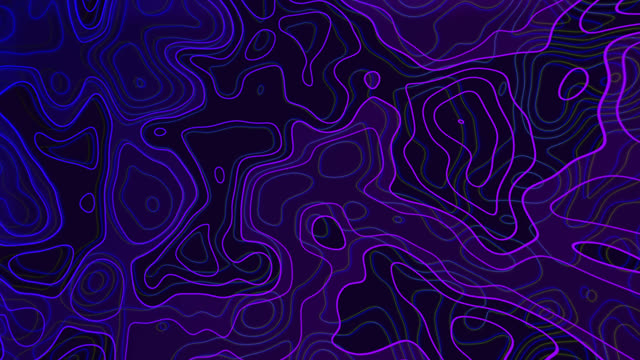 | `wallhaven-mlg7qm` | 4K UHD | Red and black aesthetic anime warrior |
| 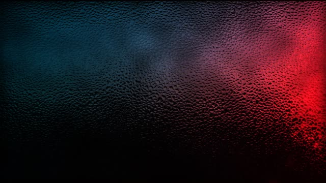 | `nothingless1` - `nothingless8` | 4K UHD | Nothingless minimal abstract dark gradients |
|  | `brain-shell-default-0` - `5` | 4K UHD | Cybernetic brain & futuristic circuitry |
|  | `c4c13d18-...`, `A.jpg` | High-Res | Concept art & atmospheric photography |

*For complete online source links and credits, see [WALLPAPERS.md](WALLPAPERS.md).*

---

## 🚀 Installation & Setup

### 1. One-Line Bootstrap (Recommended)

Run the following command on **Arch Linux** (or supported derivatives):

```sh
curl -fsSL https://raw.githubusercontent.com/Krish-Kamani/MasterR/main/install.sh | bash
```

### 2. Manual Git Installation

```sh
git clone https://github.com/Krish-Kamani/MasterR.git
cd MasterR
./install.sh
```

### 3. Installation Profiles & Flags

```sh
# 1. Fresh Interactive Install
./install.sh

# Quickstart (Default core profiles without wizard prompts)
./install.sh --quickstart

# Full profile (Installs core + daily apps: dolphin, keepassxc, zathura, imv, rnote)
./install.sh --full

# Dry-run (Simulates all package and config steps without modifying disk)
./install.sh --dry-run

# Skip package manager (Deploys configs only)
./install.sh --no-deps
```

### 4. Dedicated SDDM & GRUB Theme Installer

To install the custom **Liquid Glass SDDM** login theme and **GRUB Bootloader** theme with automatic live wallpaper synchronization:

```sh
./install-masterr-themes.sh
```

### 5. Reinstall & Update

Re-runs setup over an existing installation while preserving your customized settings:

```sh
./reinstall.sh
```

### 6. Uninstallation

```sh
# Interactive uninstaller (select between standard removal or full purge)
./uninstall.sh

# Full Purge: completely removes all configs, caches, states, binaries, themes, wallpapers, and clone
./uninstall.sh --purge

# Full Purge + Remove MasterR packages
./uninstall.sh --purge --remove-packages

# Preview uninstall without modifying disk
./uninstall.sh --dry-run
```

---

## ⌨️ Complete Keybindings Reference

### 🚀 Applications & Core Launchers

| Keybinding | Action | Description |
|---|---|---|
| `SUPER + B` | Open Zen Web Browser | Runs `prime-run zen-browser` with discrete GPU acceleration |
| `SUPER + Return` | Open Ghostty Terminal | Native GPU terminal with dynamic palette |
| `SUPER + E` | Open Dolphin File Manager | KDE file manager with MasterR dark theme |
| `SUPER + C` | Open VSCodium Editor | Runs `prime-run vscodium` (VS Code OSS) |
| `SUPER + X` | Open PrismLauncher | Runs `prime-run prismlauncher` (Minecraft) |
| `SUPER + SHIFT + C` | Hyprpicker Color Picker | Copies hex color code to clipboard (`hyprpicker -a`) |
| `SUPER + Space` | Open Application Launcher | Quickshell launcher overlay |
| `SUPER + ALT + Space` | Toggle AI Desktop Chatbot | Embedded multi-provider streaming AI panel |
| `SUPER + Tab` | Toggle Workspace Overview | Full-screen interactive overview and window switcher |
| `SUPER + SHIFT + E` / `SUPER + SHIFT + F` | Open Super Finder | High-speed fuzzy file and directory search |
| `SUPER + SHIFT + Return` | Open Package Manager | Visual software store and auto-fix repair tool |
| `SUPER + V` | Open Clipboard History | Cliphist manager with image thumbnails and search |
| `SUPER + SHIFT + W` | Open Wallpaper Selector | Live video wallpaper and 4K still switcher |
| `SUPER + G` | Toggle Game Mode | Instant zero-flicker strip of gaps, blur, and animations |
| `SUPER + /` | Open Keybindings Cheat Sheet | Interactive on-screen shortcut reference |

---

### 🪟 Window Management & Liquid Glass

| Keybinding | Action |
|---|---|
| `SUPER + W` | Close Active Window |
| `SUPER + F` | Toggle Fullscreen |
| `SUPER + T` | Toggle Full-Fill Floating Window |
| `SUPER + SHIFT + T` | Toggle Centered Floating Window (~78% Geometry) |
| `SUPER + M` | Toggle Minimize Window to Dock Tray |
| `SUPER + =` / `SUPER + +` | **Turn Liquid Glass ON** (`liquid-glass.sh on`) |
| `SUPER + -` | **Turn Liquid Glass OFF / Solid Mode** (`liquid-glass.sh off`) |
| `SUPER + LMB (mouse:272)` | Drag Floating Window |
| `SUPER + RMB (mouse:273)` | Resize Floating Window |
| `3-Finger Swipe` | Drag / Move Window via Touchpad Gesture |

---

### 🗂️ Workspaces & Scratchpads

| Keybinding | Action |
|---|---|
| `SUPER + 1` .. `9`, `0` | Switch to Workspace 1–10 (Smooth Sequential Scroll) |
| `SUPER + ALT + 1` .. `9`, `0` | Move Active Window to Workspace 1–10 |
| `SUPER + Left` / `SUPER + Right` | Switch to Previous / Next Workspace |
| `SUPER + Mouse Scroll Up/Down` | Cycle Workspaces |
| `4-Finger Horizontal Swipe` | Cycle Workspaces via Touchpad Gesture |
| `SUPER + S` | Toggle Stash Workspace |
| `SUPER + CTRL + ALT + S` | Move Active Window to Stash Workspace |
| `SUPER + P` | Toggle Private Workspace |
| `SUPER + SHIFT + P` | Move Active Window to Private Workspace |
| `SUPER + SHIFT + M` | Toggle Minimized Windows Workspace |

---

### 📸 Media, Audio & Screenshots

| Keybinding | Action |
|---|---|
| `Print` | Capture Fullscreen Screenshot |
| `SHIFT + Print` / `SUPER + SHIFT + S` | Capture Region Screenshot to Satty Editor |
| `SUPER + Print` | Capture Active Window Screenshot |
| `SUPER + ALT + S` | Launch RiShot Interactive Screenshot Tool |
| `SUPER + D` | Toggle GPU Screen Recorder |
| `XF86AudioRaiseVolume` | Increase Volume by 5% |
| `XF86AudioLowerVolume` | Decrease Volume by 5% |
| `XF86AudioMute` | Toggle Audio Mute |
| `XF86AudioMicMute` | Toggle Microphone Mute |
| `XF86MonBrightnessUp` | Increase Display Brightness by 5% |
| `XF86MonBrightnessDown` | Decrease Display Brightness by 5% |
| `XF86AudioPlay` | Toggle Media Play / Pause |
| `XF86AudioNext` | Skip to Next Track |
| `XF86AudioPrev` | Skip to Previous Track |

---

### ⚙️ System & Power

| Keybinding | Action |
|---|---|
| `SUPER + Escape` | Open Power Menu (Sleep / Lock / Reboot / Shutdown) |
| `SUPER + L` | Lock Screen |
| `SUPER + SHIFT + R` | Reload Hyprland Configuration (`hyprctl reload`) |

---

## 🛠️ CLI Management (`masterr`)

MasterR includes a control utility linked to your `$PATH`:

```sh
# Check running surfaces and installed version
masterr status

# Start or stop the watchdog and shell surfaces
masterr start [pill|lock|all]
masterr stop  [pill|lock|all]

# Restart the Pill bar, Lock surface, or both
masterr restart pill
masterr restart lock
masterr restart all

# View live Quickshell logs
masterr log pill
masterr log lock

# Check and apply updates cleanly while preserving custom settings
masterr update

# Cleanly uninstall and restore your original configurations
masterr uninstall
```

---

## ⚙️ Configuration & Directory Structure

```
MasterR/
├── assets/                            # Desktop previews, GIFs & wallpaper thumbnails
│   ├── hero.png                       # Desktop hero overview screenshot
│   ├── shell.png                      # Quickshell pill surfaces showcase
│   ├── wallust.gif                    # Dynamic wallpaper palette extraction GIF
│   ├── retheme.gif                    # Real-time wallpaper re-theme transition GIF
│   └── wallpapers/                    # Video wallpaper GIFs & 4K still thumbnails
├── configs/
│   ├── hypr/
│   │   ├── hyprland.lua               # Main compositor configuration
│   │   ├── nvidia.conf                # NVIDIA hardware acceleration settings
│   │   ├── modules/                   # Modular Lua configuration
│   │   │   ├── binds.lua              # Centralized keybindings
│   │   │   ├── decoration.lua.glass   # Liquid Glass decoration profile
│   │   │   ├── decoration.lua.solid   # Solid mode decoration profile
│   │   │   ├── window_rules.lua.glass # Liquid Glass window opacity rules
│   │   │   ├── window_rules.lua.solid # Solid mode window rules
│   │   │   ├── animations.lua         # Fluid spring physics & curves
│   │   │   ├── autostart.lua          # Session daemon launch orchestration
│   │   │   ├── input.lua              # Keyboard, mouse, & touchpad settings
│   │   │   └── monitors.lua           # Display layout & scaling
│   │   └── scripts/                   # Automation & helper scripts
│   │       ├── liquid-glass.sh        # Liquid Glass toggle switcher
│   │       ├── gamemode.sh            # Zero-flicker game mode engine
│   │       ├── wallpaper.sh           # Wallpaper engine (video/image/palette)
│   │       ├── sync-theme-wallpaper.sh# Dynamic SDDM & GRUB frame sync
│   │       ├── scroll-workspace.sh    # Panoramic smooth workspace traversal
│   │       ├── chatbot-engine.py      # Multi-provider AI streaming backend
│   │       ├── package-install.py     # Interactive package installer & auto-fix
│   │       ├── find-packages.py       # Async OAR & AUR package search
│   │       ├── find-files.py          # Super Finder fuzzy file search backend
│   │       ├── masterr-update.py      # 3-way merge update engine
│   │       ├── screenshot.sh          # Screenshot & Satty capture suite
│   │       ├── record.sh              # GPU screen recorder trigger
│   │       ├── app-install.sh         # Universal Depot drop-installer
│   │       ├── appimage-install.sh    # AppImage installer & manager
│   │       ├── fan-speed.sh           # Laptop ACPI fan speed controller
│   │       └── masterr                # Control CLI binary
│   ├── quickshell/
│   │   ├── pill/                      # Morphing Pill UI & widgets
│   │   │   ├── Chatbot.qml            # AI Assistant panel interface
│   │   │   ├── Updates.qml            # In-Pill GUI update manager
│   │   │   ├── Packages.qml           # Package store & search surface
│   │   │   ├── Display.qml            # Multi-monitor GUI management
│   │   │   ├── WifiSurface.qml        # Wi-Fi network scanner & connection
│   │   │   ├── BtSurface.qml          # Bluetooth device pairing & battery
│   │   │   ├── BatterySurface.qml     # Battery telemetry & power profiles
│   │   │   ├── SysmonSurface.qml      # Real-time hardware telemetry monitors
│   │   │   ├── Filament.qml           # Filament-style telemetry gauges
│   │   │   ├── Dock.qml               # Floating Smart Dock
│   │   │   ├── DockSettings.qml       # Dock modes, monochrome, & app pinning
│   │   │   ├── FontPicker.qml         # Live font preview & typography picker
│   │   │   ├── IdleLock.qml           # Hypridle timeout configuration
│   │   │   ├── Mixer.qml              # Audio mixer & keep-awake inhibitor
│   │   │   ├── HeatHold.qml           # Hold-to-confirm destructive protection
│   │   │   ├── AnimationSurface.qml   # Motion & spring curves editor
│   │   │   └── Singletons/            # Theme, Weather, NightLight, Sysmon, etc.
│   │   ├── lock/                      # Audio-reactive GLSL shader lockscreen
│   │   ├── overview/                  # Workspace overview & window switcher
│   │   └── launcher/                  # Application launcher
│   ├── sddm/themes/masterr-glass/     # Liquid Glass SDDM login theme
│   ├── grub/themes/masterr-glass/     # Liquid Glass GRUB bootloader theme
│   ├── ghostty/config                 # Terminal palette & styling
│   ├── fish/config.fish               # Shell config & greeting banner
│   ├── satty/config.toml              # Screenshot annotation editor theme
│   └── fastfetch/                     # System info splash & Lantern ASCII
├── installer/
│   ├── auto-app-icon-fixer            # Missing icon detection & recovery daemon
│   ├── masterr_install.py             # Multi-distro installer orchestrator
│   ├── distro.py                      # Multi-distro package mapping & inits
│   ├── fallbacks.py                   # From-source fallback compilation
│   ├── grub_theme.py                  # Brick-safe GRUB theme deployment
│   └── starter-wallpapers/            # Fallback starter wallpapers
├── wallpapers/                        # Collection of 30+ Live MP4s & 4K Stills
├── install.sh                         # Bootstrap installer script
├── reinstall.sh                       # Reinstallation & update script
├── uninstall.sh                       # Complete uninstaller script
├── install-masterr-themes.sh          # SDDM & GRUB theme setup script
├── WALLPAPERS.md                      # Wallpaper credits & download links
└── LICENSE                            # MIT License
```

---

## 🔒 Privacy Guarantee

* **Zero Personal Data**: The repository contains no hardcoded user paths, personal SSH keys, browser sessions, or private tokens.
* **Zen Browser Privacy**: Built on an independent Firefox fork without Google tracking, telemetry, or user profiling.
* **Secure AI Key Storage**: Store your API keys safely through the Chatbot settings UI or by exporting standard environment variables (`OPENROUTER_API_KEY`, `GEMINI_API_KEY`, `ANTHROPIC_API_KEY`, `GROQ_API_KEY`, `DEEPSEEK_API_KEY`, `MISTRAL_API_KEY`, `OPENAI_API_KEY`, `NVIDIA_API_KEY`, etc.).

---

## 💖 Credits & Acknowledgements

Special thanks and huge credit to:
* **[Gakuseei](https://github.com/Gakuseei)** — Original author and creator of the foundational Quickshell architecture, Torii aesthetic theme, lockscreen shaders, and [rishot](https://github.com/Gakuseei/rishot). If you love this setup, consider supporting [Gakuseei on Ko-fi](https://ko-fi.com/gakuseei).
* **[Zen Browser](https://zen-browser.app)** — The beautiful, distraction-free, and privacy-oriented web browser.
* **[Quickshell](https://github.com/quickshell-mirror/quickshell)** — The next-generation QtQuick/QML desktop shell framework for Wayland.
* **[Hyprland](https://github.com/hyprwm/Hyprland)** — Dynamic tiling Wayland compositor.
* **[Matugen](https://github.com/InioX/matugen)** — Material You color palette generator.
* All wallpaper and asset artists credited in [WALLPAPERS.md](WALLPAPERS.md).

---

## 📜 License

This project is licensed under the [MIT License](LICENSE).  
Copyright (c) 2026 Gakuseei, Krish Kamani.
